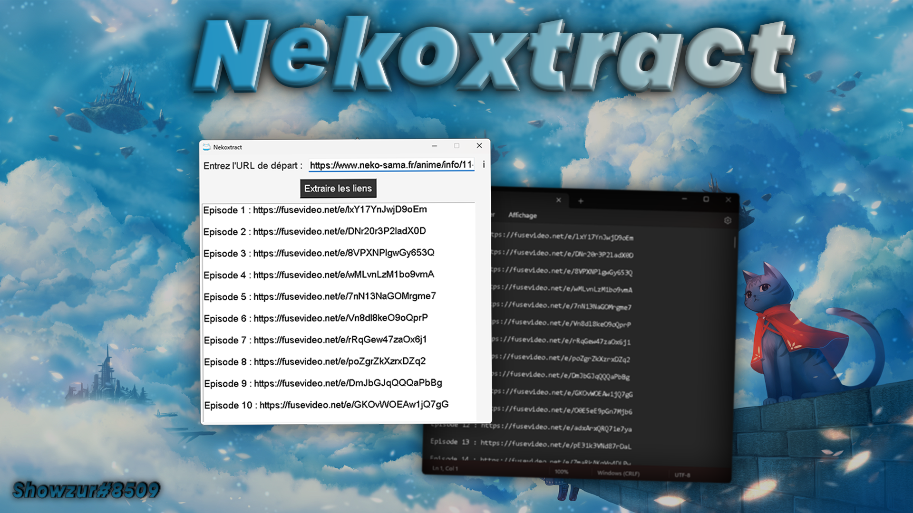

<h1 align="center">AnimecatXtract </h1>

> 🪝 Here is a program that retrieves streaming links from the animecat.net website.

##  👇 Downloads

 

## 🚀 Usage - Exe Method (Releases)

**First Step :** Simply click on the AnimecatXtract-setup.exe file

**Second Step :** Simply click on the AnimecatXtract.exe file  
Then go to the site animecat.net to find the anime you want like this example  [https://animecat.net/anime/info/11-naruto_vostfr] then see the result for yourself.

## 🚀 Usage - Python Method

**First Step :** `pip install -r requirements.txt`

**Second Step :** `py animecatxtract.py` or `py animecatxtract-cli.py`  

## 👤 Author

**Showzur**

* SRV Discord: [Shynonime](https://discord.gg/UHy8mZsNh8)
* Twitter: [@Showzur](https://twitter.com/Showzur)
* Github: [@shwzr](https://github.com/shwzr)

## Show your support

Give a ⭐️ if this project helped you!

## 📝 License

Copyright © 2023 [Showzur](https://github.com/shwzr). 

***
